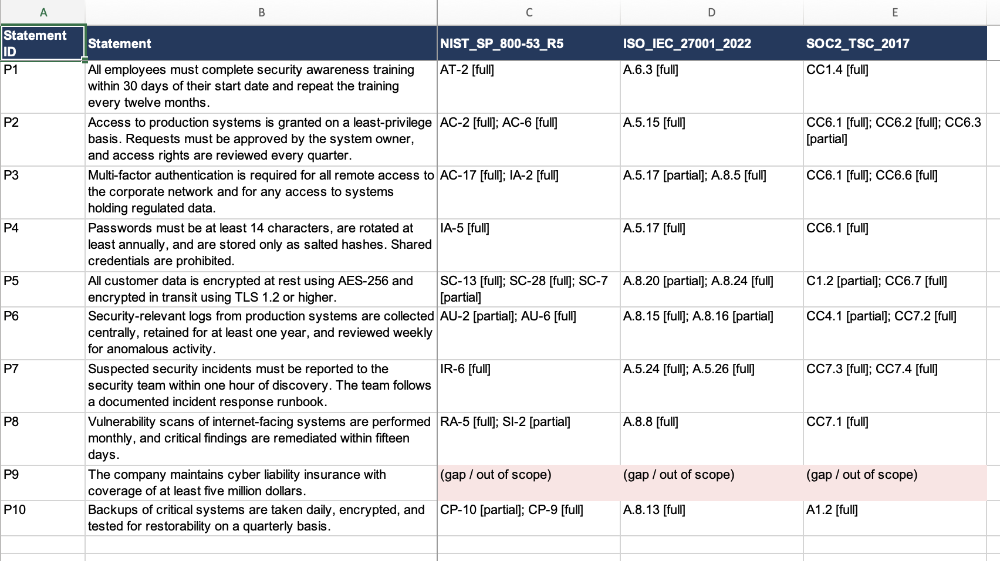

## Control Mapper

**Maps organizational policy statements to compliance framework controls (NIST SP 800-53, ISO/IEC 27001:2022 Annex A, SOC 2), crosswalks the frameworks against each other, flags coverage gaps — and measures how often the AI gets it right.**


Crosswalking a policy against one control framework is hours of manual, error-prone
work in every GRC program. Doing it across *three* frameworks, and keeping the
mappings consistent, is worse. This tool drafts those mappings with Claude, derives
a cross-framework crosswalk from shared policy evidence, and then does the part that
actually matters in a regulated environment: it tells you **how much to trust the
output**, with a precision/recall evaluation against a hand-labeled gold standard
for each framework.

> Built by a GRC / cybersecurity analyst. The design choices here — forcing
> structured output, rejecting hallucinated control IDs, computing headline numbers
> in deterministic code rather than asking the model, anchoring the crosswalk in
> policy evidence, and treating every mapping as a draft for human review — reflect
> how this work is assessed in practice, not just how to call an API.

---

## What it does

1. **Parses** a policy document into discrete, numbered statements.
2. **Maps** each statement to relevant controls in a chosen framework using Claude,
   returning for each link a coverage level (`full` / `partial`), a confidence
   score, and a short rationale.
3. **Analyzes** coverage deterministically: covered controls, gaps, and statements
   that map to nothing (a scope / over-coverage signal).
4. **Crosswalks** the frameworks: because every framework is mapped against the
   *same* statements, controls in different frameworks that satisfy the same
   statement are equivalent for that obligation — an evidence-backed crosswalk
   rather than an asserted one.
5. **Evaluates** the model's mappings against a per-framework hand-labeled gold
   standard and reports precision, recall, F1, and the exact false positives and
   false negatives.
6. **Exports** the crosswalk to CSV (flat, one row per mapping) and to a formatted
   multi-sheet XLSX (Summary, Crosswalk, Mappings, Gaps) that a GRC team can open in
   Excel and hand to an auditor.

## Frameworks included

| Framework | File | Notes |
|---|---|---|
| NIST SP 800-53 Rev. 5 (subset) | `data/frameworks/nist_800-53_subset.json` | Control IDs are U.S. Government public domain |
| ISO/IEC 27001:2022 Annex A (subset) | `data/frameworks/iso_27001_2022_annexa_subset.json` | IDs/titles are factual references; descriptions are original |
| SOC 2 Trust Services Criteria (subset) | `data/frameworks/soc2_tsc_subset.json` | IDs/categories are factual references; descriptions are original |

Each is a ~21-control subset chosen to exercise the sample policy and to leave real
gaps. Adding a framework is just another JSON file plus a gold set — no code change.

## Why these design choices

- **Forced structured output.** The model must call a tool whose JSON schema
  matches the data model exactly (`src/control_mapper/mapper.py`). No prose
  scraping; output is parseable and testable.
- **Trust, but verify the model.** Any control ID the model invents, or any
  statement ID it hallucinates, is discarded before it reaches the analysis.
- **Deterministic headline numbers.** Coverage ratios, gaps, and the crosswalk are
  computed in code, so they are reproducible and defensible — not a second opinion
  from an LLM.
- **Evidence-anchored crosswalk.** Cross-framework equivalences are justified by the
  shared policy statement, so every correspondence cites *why*.
- **Evaluation is a first-class feature.** `eval/` scores the model against ground
  truth per framework and surfaces *where it fails*.
- **Secrets stay out of the code.** The API key is read from the environment by the
  SDK; never an argument, never logged, and `.env` is git-ignored.

## Quickstart

```bash
git clone https://github.com/PilotGuy13/control-mapper && cd control-mapper
python -m venv .venv && source .venv/bin/activate
pip install -r requirements.txt
```

Map a policy to one framework, **offline** (no API key, no network, no cost):

```bash
python -m control_mapper.cli \
  --policy data/sample_policies/sample_policy.md \
  --framework data/frameworks/iso_27001_2022_annexa_subset.json \
  --offline
```

Run the **crosswalk** across all three frameworks (offline), with control
equivalences anchored on NIST:

```bash
python -m control_mapper.cli \
  --policy data/sample_policies/sample_policy.md \
  --crosswalk \
  --framework data/frameworks/nist_800-53_subset.json \
  --framework data/frameworks/iso_27001_2022_annexa_subset.json \
  --framework data/frameworks/soc2_tsc_subset.json \
  --equivalences NIST_SP_800-53_R5 \
  --offline
```

Run the **evaluation** for every framework offline and see precision/recall plus
every error:

```bash
PYTHONPATH=src:. python -m eval.evaluate --offline --all
```

Export the crosswalk to **CSV and a formatted Excel workbook**:

```bash
python -m control_mapper.cli \
  --policy data/sample_policies/sample_policy.md \
  --crosswalk \
  --framework data/frameworks/nist_800-53_subset.json \
  --framework data/frameworks/iso_27001_2022_annexa_subset.json \
  --framework data/frameworks/soc2_tsc_subset.json \
  --export-csv crosswalk.csv \
  --export-xlsx crosswalk.xlsx \
  --offline
```

The `.xlsx` has four sheets:

| Sheet | Contents |
|---|---|
| Summary | Per-framework counts (controls, mappings, full/partial) as live Excel formulas |
| Crosswalk | One row per obligation; a column per framework with the matched controls |
| Mappings | Long, auditable detail: statement, framework, control, coverage, confidence, rationale (auto-filtered) |
| Gaps | Controls in each framework that no statement covered |

Run against the **live model** (drop `--offline`, set your key):

```bash
cp .env.example .env        # add your key
export $(grep -v '^#' .env | xargs)
PYTHONPATH=src:. python -m eval.evaluate --all
```

Launch the **UI** (framework picker in the sidebar):

```bash
streamlit run app.py
```

Run the **tests** (offline):

```bash
pytest
```

## Example: crosswalk output (offline)

```
P1: All employees must complete security awareness training within 30 days...
    NIST_SP_800-53_R5        AT-2 [full]
    ISO_IEC_27001_2022       A.6.3 [full]
    SOC2_TSC_2017            CC1.4 [full]

P3: Multi-factor authentication is required for all remote access...
    NIST_SP_800-53_R5        AC-17 [full], IA-2 [full]
    ISO_IEC_27001_2022       A.5.17 [partial], A.8.5 [full]
    SOC2_TSC_2017            CC6.1 [full], CC6.6 [full]
```

One obligation, the equivalent controls in each framework — that is the table a GRC
team actually wants when they hold one certification and are pursuing another.

## Example: evaluation summary (offline stub)

```
SUMMARY
--------------------------------------------------------
  NIST_SP_800-53_R5         P 93.8%  R 88.2%  F1 90.9%
  ISO_IEC_27001_2022        P 92.3%  R 85.7%  F1 88.9%
  SOC2_TSC_2017             P 93.3%  R 87.5%  F1 90.3%
```

These numbers come from a deliberately imperfect stub so the harness has real errors
to find (e.g. it misses that "cyber liability insurance" maps to SOC 2 **CC9.1**, a
realistic and instructive miss). Against the live model they will differ — which is
the point: re-run the eval whenever you change the prompt and watch the score move.

A crosswalk insight that falls out of this: the cyber-insurance statement is **out
of scope** for the NIST and ISO subsets but **in scope** for SOC 2 (CC9.1). A single
framework would have silently dropped it.

## Project layout

```
control-mapper/
├── README.md, requirements.txt, pyproject.toml, .env.example, .gitignore
├── src/control_mapper/
│   ├── models.py        # typed data models (Pydantic)
│   ├── frameworks.py    # load frameworks, parse policies
│   ├── mapper.py        # Claude call w/ forced structured output + guardrails
│   ├── analysis.py      # deterministic gap / over-coverage analysis
│   ├── crosswalk.py     # evidence-anchored cross-framework crosswalk
│   ├── export.py        # CSV + formatted XLSX export of the crosswalk
│   └── cli.py           # command-line interface (single + crosswalk modes)
├── data/
│   ├── frameworks/      # NIST, ISO 27001:2022, SOC 2 subsets
│   └── sample_policies/ # fictional sample policy
├── eval/
│   ├── gold/            # per-framework hand-labeled gold standards
│   ├── stub_client.py   # deterministic, framework-aware offline client
│   └── evaluate.py      # precision / recall / F1 harness (per framework / --all)
├── tests/               # pytest, fully offline
└── app.py               # Streamlit UI with framework picker
```

## Roadmap

- Ingest PDF/DOCX policies directly instead of pre-numbered text.
- Expand gold standards and report per-control-family accuracy.
- Inter-rater notes on the labels, since some `partial` calls are debatable.
- Add a one-click "evidence pack" export bundling the workbook with the eval report.

## Limitations & responsible use

Mappings and crosswalks are **AI-assisted drafts**. A qualified human must review
every mapping before it is used as audit evidence or a compliance assertion. This is
a productivity and triage aid, not a compliance attestation, and nothing here is
legal or regulatory advice.

**Source notes.** NIST SP 800-53 control identifiers and family names are from a U.S.
Government public-domain publication. ISO/IEC 27001:2022 and the AICPA Trust Services
Criteria are copyrighted; this repo uses only their control/criterion reference
identifiers and standard short titles (factual references) and pairs them with
original condensed descriptions written for this demo — **not** the official text of
either standard. For authoritative wording, consult the licensed publications.
